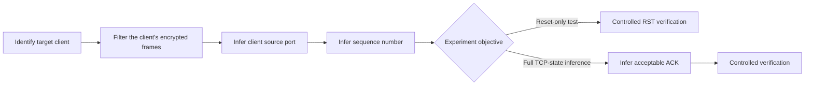
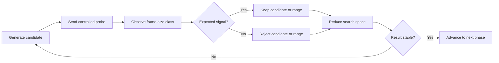
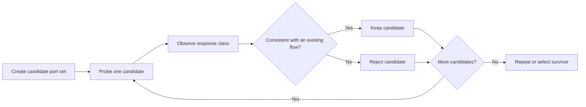
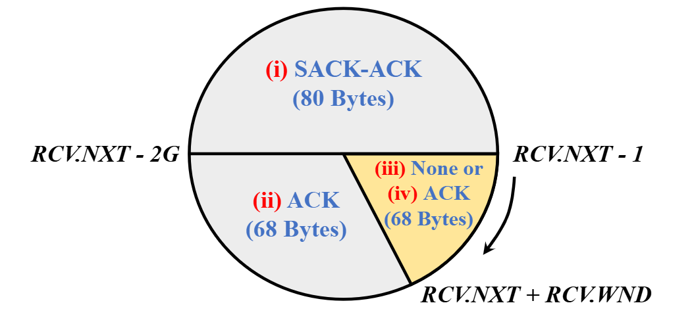
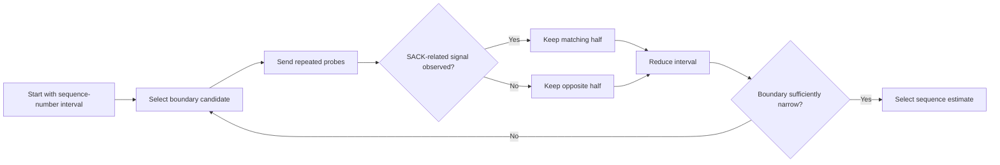
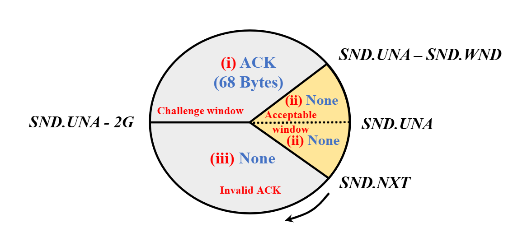
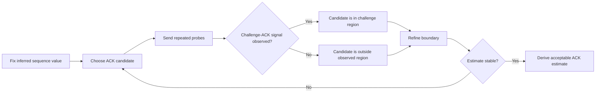
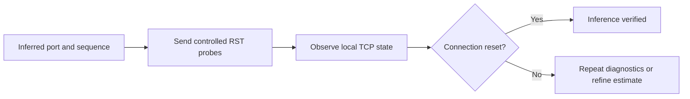

# Off-Path TCP Hijacking via a Wi-Fi Frame-Size Side Channel

> Code implementation for the paper<br>
> Computer Network final project<br>
> **Ziqiang Wang et al., “Off-Path TCP Hijacking in Wi-Fi Networks:**<br>
> **A Packet-Size Side-Channel Attack,” NDSS 2025.**

Although Wi-Fi encryption protects packet contents, it does not necessarily hide the size of each encrypted frame. Different TCP validation paths can produce responses with different lengths. By sending controlled probes and observing the resulting frame-size classes, an off-path observer may progressively infer otherwise unknown TCP connection state.


## What the side channel reveals

The payload of an encrypted Wi-Fi frame is not readable without the session key. However, some metadata remains observable, including:

- transmitter and receiver MAC addresses,
- transmission timing,
- frame direction,
- encrypted frame length.

The method relies on the fact that a TCP endpoint may respond differently depending on whether a forged segment contains:

- the correct TCP four-tuple,
- a sequence number below or above a validation boundary,
- an acknowledgment number inside or outside a challenge window.

These different responses can produce distinguishable encrypted frame sizes.

### Example response classes from the paper

For the paper's IPv4 test environment:

| TCP response | TCP/IP packet size | Observed encrypted frame size |
|---|---:|---:|
| RST | 54 bytes | 56 bytes |
| ACK with timestamp | 66 bytes | 68 bytes |
| SACK-ACK with timestamp | 78 bytes | 80 bytes |

These values are observation classes from a specific configuration, not universal protocol constants. Actual sizes may differ with IPv6, TCP options, link-layer encapsulation, operating system behavior, drivers, or hardware.


## Method overview

The paper first identifies the victim and target connection, then infers the unknown TCP state. Once sufficient state has been recovered, the result can be verified in a controlled experiment.



The implementation follows a repeated filtering pattern:



---

## Match and rejection signals

Each probe produces one of two logical outcomes:

- **Match:** the observation is consistent with the current candidate.
- **Rejection:** the observation is inconsistent with the current candidate.

A single observation may be unreliable because of background traffic, frame loss, or timing variation. The implementation can therefore repeat probes and make decisions from multiple observations.

Conceptually:

```text
candidate set
    -> send probe
    -> classify observed response
    -> keep matching candidates
    -> remove rejected candidates
    -> repeat with a smaller search space
```

---

## Phase 0: identify and observe the target

Before inferring TCP values, the observer must isolate the target client's traffic.

In the original method, the observer determines the target client's IP and MAC addresses, then filters captured 802.11 frames using the visible MAC-layer address fields.

The encrypted payload remains unreadable. Only frame metadata and length are used by the inference logic.


---

## Phase 1: infer the client source port

### Objective

Determine the client-side source port of an existing TCP connection.

A TCP connection is identified by the four-tuple:

```text
client IP, client port, server IP, server port
```

The client IP, server IP, and server port are assumed to be known. The remaining unknown value is the client source port.

### Signal used by the method

For each candidate port, the observer sends a controlled probe that appears to originate from the client.

In the behavior described by the paper:

- a probe matching an established connection may cause a challenge ACK;
- a probe that does not match the connection may cause a RST;
- the resulting ACK and RST frames belong to different size classes.

The implementation repeats this process across the configured port range and retains candidates whose observations match the expected response class.



### Example

```text
Initial candidates:
49150, 49152, 49154, 49156, 49158, 49160

Repeated matching candidate:
49156

Selected client port:
49156
```

---

## Phase 2: infer the sequence number


### Objective

Locate the boundary around the server's next expected sequence number, commonly represented as `RCV.NXT`.

### Signal used by the method

The observer sends forged TCP data segments containing candidate sequence numbers.

Depending on where a candidate lies relative to the receiver's sequence state, the endpoint may produce:

- a SACK-ACK response,
- a normal ACK response,
- a challenge ACK,
- no response.

The paper uses the larger SACK-ACK frame as a particularly useful signal. By determining whether a probe produces the SACK-related response class, the search can distinguish opposite sides of the sequence boundary.

Rather than checking every possible 32-bit value, the method adaptively narrows the interval.



### Result

The phase produces either:

- an exact sequence boundary estimate, or
- a sequence value within the receiver's acceptable window.

---

## Phase 3: infer an acceptable acknowledgment number


### Objective

Find an acknowledgment value that the receiver will accept for further TCP processing.

### Signal used by the method

With a usable sequence number fixed, the observer sends ACK probes containing candidate acknowledgment numbers.

The TCP acknowledgment space can be divided conceptually into:

1. a **challenge window**, where a challenge ACK is generated;
2. an **acceptable window**, where the segment may be accepted without the same observable response;
3. an **invalid region**, where the segment may be silently discarded.

The challenge ACK produces an observable frame-size signal. The method first locates that challenge region and then narrows one of its boundaries to derive an acceptable ACK estimate.



ACK observations are often noisier than sequence-number observations. Multiple samples should therefore be used before accepting or rejecting a region.

---

## Phase 4: controlled RST verification

### Objective

Send a small number of RST packets using the inferred connection values. The local monitor then checks whether the TCP connection transitions toward a reset or closed state.



---

## Repository layout

```text
tcp_attack/
├── tcp_test_server.py    # Local TCP server, client, and state monitor
├── tcp_attack.py         # Inference workflow and optional RST verification
└── README.md             # Project documentation
```

---

## Requirements

- Python 3
- root privileges for raw-packet operations
- a Linux environment for the active probing component

---

## Quick start

Open three terminals.

### Terminal 1: start the test server

```bash
python3 tcp_test_server.py server \
    --host 127.0.0.1 \
    --port 12345
```

### Terminal 2: create a long-lived client connection

```bash
python3 tcp_test_server.py client \
    --host 127.0.0.1 \
    --port 12345
```

### Terminal 3: monitor the local TCP state

```bash
python3 tcp_test_server.py monitor \
    --port 12345
```

Run the research workflow from another terminal:

```bash
sudo python3 tcp_attack.py \
    --server-port 12345
```

---

## Operating modes

### Full configured workflow

Run the enabled discovery phases followed by optional RST verification:

```bash
sudo python3 tcp_attack.py \
    --server-port 12345
```

### Reset-oriented workflow

Skip ACK inference when the experiment only requires sequence-based reset verification:

```bash
sudo python3 tcp_attack.py \
    --server-port 12345 \
    --skip-ack
```

### Discovery-only mode

Run inference without sending the final RST packets:

```bash
sudo python3 tcp_attack.py \
    --server-port 12345 \
    --no-rst
```

For initial testing, discovery-only mode is recommended.

---

## Command-line options

### `tcp_attack.py`

| Option | Description | Default |
|---|---|---:|
| `--client-ip` | Test client IP address | `127.0.0.1` |
| `--server-ip` | Test server IP address | `127.0.0.1` |
| `--server-port` | Test server TCP port | `12345` |
| `--start-port` | First candidate client port | `49152` |
| `--end-port` | Last candidate client port | `65535` |
| `--step-size` | Port-search stepping interval | `16` |
| `--packet-repeat` | Number of observations per candidate | `1` |
| `--rst-count` | Number of RST packets used for verification | `5` |
| `--skip-ack` | Skip acknowledgment-number inference | disabled |
| `--no-rst` | Disable final RST verification | disabled |

### `tcp_test_server.py`

| Argument | Description | Default |
|---|---|---:|
| `mode` | `server`, `client`, or `monitor` | required |
| `--host` | Local bind or destination address | `127.0.0.1` |
| `--port` | Local test port | `12345` |

---

## How to interpret the output

A normal run should report the result of each inference stage separately:

```text
[port]      selected candidate or candidate set
[sequence]  inferred sequence estimate or interval
[ack]       inferred ACK estimate, if enabled
[verify]    reset accepted, rejected, or inconclusive
```

---


## Reference

Ziqiang Wang, Xuewei Feng, Qi Li, Kun Sun, Yuxiang Yang, Mengyuan Li,  
Ganqiu Du, Ke Xu, and Jianping Wu.

**“Off-Path TCP Hijacking in Wi-Fi Networks: A Packet-Size Side-Channel Attack.”**  
Network and Distributed System Security Symposium, NDSS 2025.

```bibtex
@inproceedings{wang2025offpath,
  title     = {Off-Path TCP Hijacking in Wi-Fi Networks:
               A Packet-Size Side-Channel Attack},
  author    = {Wang, Ziqiang and Feng, Xuewei and Li, Qi and Sun, Kun
               and Yang, Yuxiang and Li, Mengyuan and Du, Ganqiu
               and Xu, Ke and Wu, Jianping},
  booktitle = {Network and Distributed System Security Symposium},
  year      = {2025}
}
```
